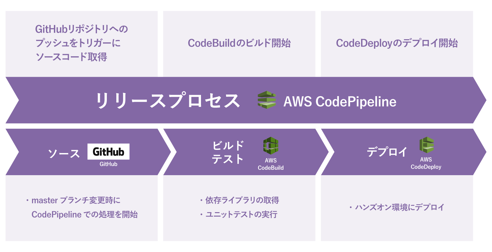

# ハンズオンで構築する構成

今回は上記の図のような構成を構築します。

- GitHubにコードがプッシュされるとCodePipelineでの処理が開始されます
- テスト実行用CodeBuildではテストを実行します
- アラートチェック用CodeBuildではアラートが発報されていないかチェックします
- CodeBuildでの処理が成功したらEC2に新しいバージョンのイメージがデプロイされます
