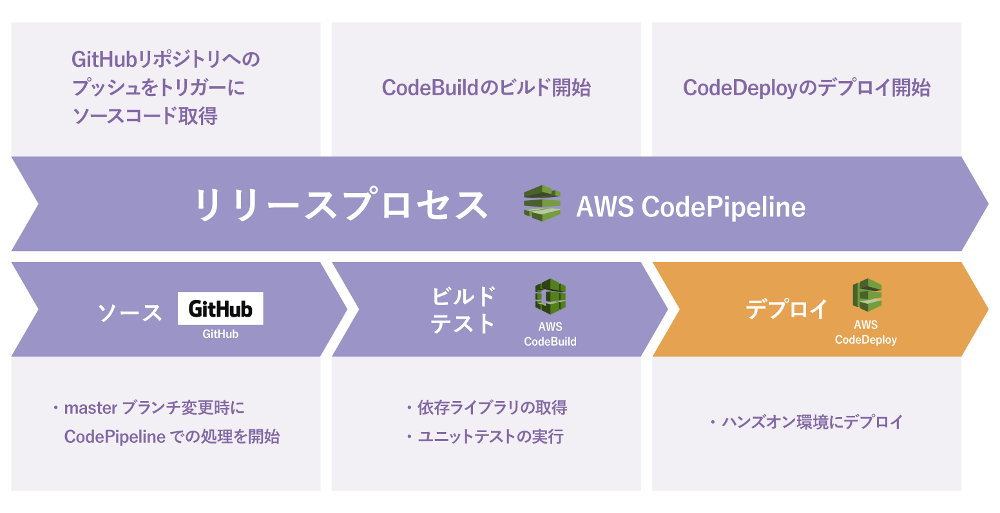

# CodeDeploy の設定

CodePipeline からのデプロイ先を作成するため、先に CodeDeploy の設定を行っていきます。

CodeDeploy ではアプリケーションとデプロイグループを作成していきます。

簡単に説明すると、アプリケーションはデプロイの設定をまとめるものであり、デプロイグループはデプロイ先のインスタンスの集合とデプロイの設定をまとめたものです。

CodeDeploy のアプリケーションの画面からアプリケーションの作成をクリックします。

表示されたダイアログに以下のような入力項目を入力します。

| 入力項目                           | 値               |
| ---------------------------------- | ---------------- |
| アプリケーション名                 | `hands-on-app`   |
| コンピューティングプラットフォーム | EC2/オンプレミス |

アプリケーションの作成をクリックすると、CodeDeploy のアプリケーションが作成され、当該アプリケーションの詳細画面が表示されます。

この画面からさらに「デプロイグループの作成」をクリックし、このアプリケーションにデプロイグループを作成します。

| 入力項目                         | 値                                                     |
| -------------------------------- | ------------------------------------------------------ |
| デプロイグループ名               | `hands-on-deploy-group`                                |
| サービスロール                   | `hands-on-environment-CodeDeploy-ServiceRole`          |
| デプロイタイプ                   | `インプレース`                                           |
| Amazon EC2 Auto Scaling グループ | ✔                                                      |
| Auto Scaling グループ            | `hands-on-environment-EC2AutoScalingGroup-XXXXXXX`     |
| デプロイ設定                     | `CodeDeployDefault.HalfAtOnce`                           |
| ロードバランシングを有効にする   | ✔                                                      |
|                                  | Application Load Balancer または Network Load Balancer |
| Choose a load balancer           | `hands-on-environment-TargetGroup`                     |

