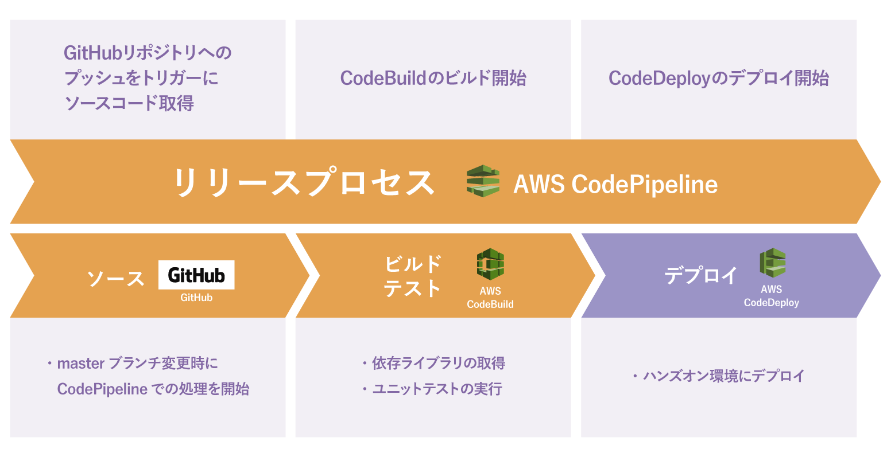
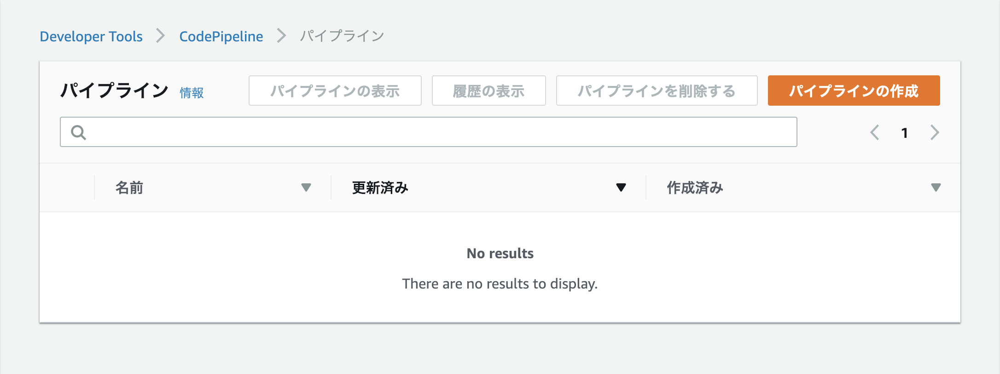
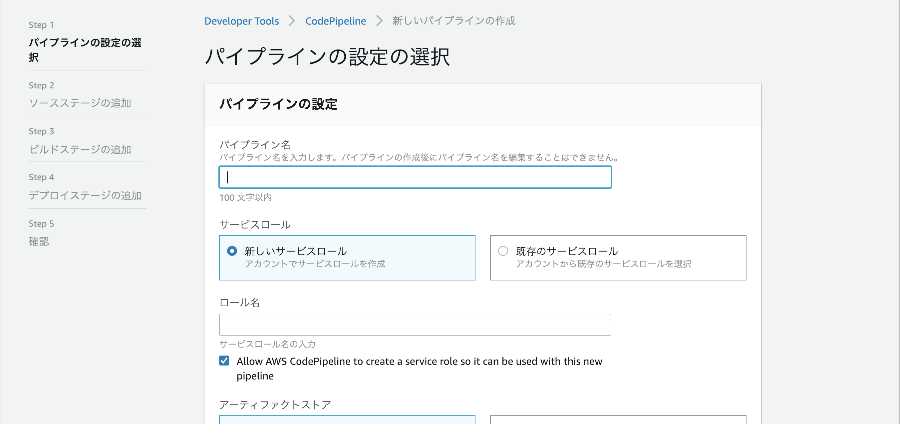
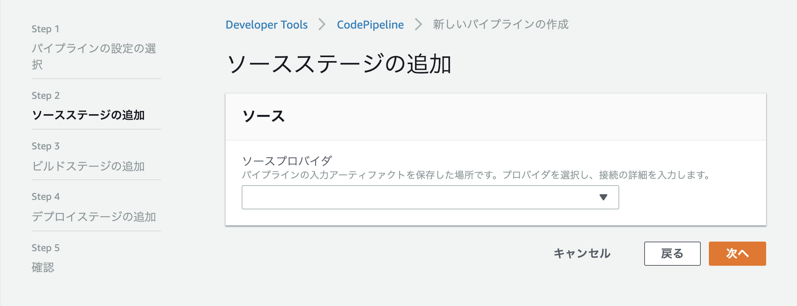
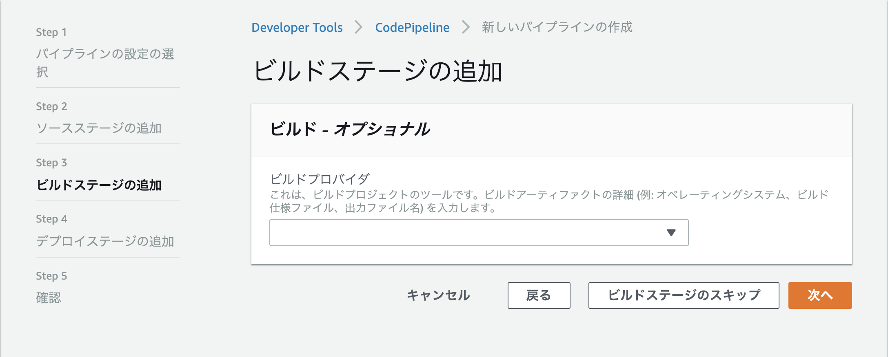
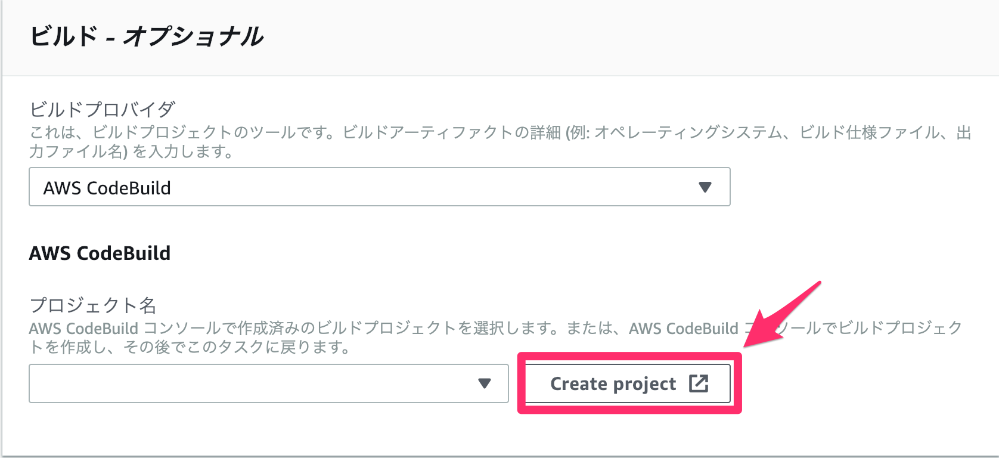
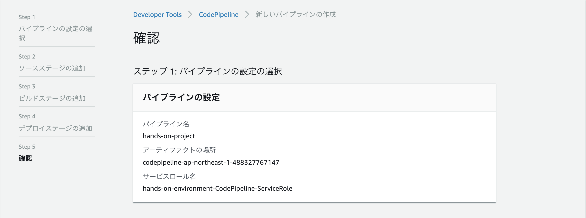

# CodePipeline によるパイプラインの構築および自動デプロイの実行

CodeDeploy の設定が済んだところで、CodePipeline/CodeBuild/CodeDeploy を使用したパイプラインを作成していきます。

今回作成するパイプラインは以下図の左側の部分です。

## パイプラインの作成開始まで

マネジメントコンソールのトップ画面より「CodePipeline」をクリックします。

すると、以下のような画面が表示されます。

「パイプラインの作成」をクリックします。

## 「パイプラインの設定の選択」画面

「パイプラインの設定の選択」画面に遷移します。

以下の表のように入力します。

| 入力項目               | 値                                              |
| ---------------------- | ----------------------------------------------- |
| パイプライン名         | `hands-on-pipeline`                             |
| サービスロール         | 既存のサービスロール                            |
| サービスロール名       | `hands-on-environment-CodePipeline-ServiceRole` |
| アーティファクトストア | デフォルトの場所　                              |

入力が終わったら、「次へ」をクリックします。

## 「ソースステージの追加」画面

「ソースステージの追加」画面に遷移します。

ビルドプロバイダとして、`GitHub`を選択すると表示される`GitHub`というボタンをクリックします。

CodePipelineでGitHubを使用する設定を行うのが初回の場合、ボタンをクリックすると、以下の画像のような画面が表示されるので、`Authorize aws-codesuite`ボタンを押してください。

GitHubとの接続が完了したら以下の表のように入力します。

| 入力項目           | 値                             |
| ------------------ | ------------------------------ |
| ソースプロバイダ   | GitHub                         |
| リポジトリ         | `フォークしておいたリポジトリ` |
| ブランチ           | master                         |
| 変更検出オプション | GitHub ウェブフック(推奨)      |

入力が終わったら、「次へ」をクリックします。

## 「ビルドステージの追加」　画面

「ビルドステージの追加」画面に遷移します。

ビルドプロバイダとして、`AWS CodeBuild`を選択すると表示される`Create Project`というボタンをクリックします。

### CodeBuildのプロジェクト作成ウィンドウ

CodeBuild のプロジェクト作成画面が新しいウィンドウで開きます。

CodeBuild のプロジェクトを作成していきます。

#### プロジェクトの設定
| 入力項目                 | 値                   |
| ------------------------ | -------------------- |
| プロジェクト名           | `hands-on-project`   |

#### 環境
| 入力項目                 | 値                   |
| ------------------------ | -------------------- |
| 環境イメージ             | マネージド型イメージ |
| オペレーティングシステム | Ubuntu               |
| ランタイム               | Node.js              |
| ランタイムバージョン | aws/codebuild/nodejs:10.14.1 |
| イメージのバージョン | このランタイムバージョンには常に最新のイメージを使用してください
| 特権付与 | ✔  |
| サービスロール | 既存のサービスロール |
| ロール名 | `hands-on-environment-CodeBuild-ServiceRole` |
| AWS CodeBuildにこのサービスロールの編集を許可し | (チェックを外す) |

#### Buildspec
| 入力項目                 | 値                   |
| ------------------------ | -------------------- |
| ビルド仕様 | buildspecファイルを使用する |
| BuildSpec名 | (空欄のまま) |

入力が済んだら「CodePipelineに進む」ボタンをクリックします

### CodePipeline作成画面に戻った後
CodePipelineの画面に戻ったら、以下のように入力されていることを確認し、「次へ」をクリックします。

| 入力項目                 | 値                   |
| ------------------------ | -------------------- |
| ビルドプロバイダ | AWS CodeBuild |
| プロジェクト名 | `hands-on-project` |

## 「デプロイステージの追加」画面

「デプロイステージの追加」画面に遷移します。

以下の表のように入力します。

| 入力項目           | 値                      |
| ------------------ | ----------------------- |
| デプロイプロバイダ | `AWS CodeDeploy`          |
| アプリケーション名 | `hands-on-app`          |
| デプロイグループ名 | `hands-on-deploy-group` |

入力が終わったら、「次へ」をクリックします。

最後に確認画面が表示されるので、内容を確認後、「パイプラインの作成」をクリックします。

「次へ」をクリックします

## 確認画面
最後に確認画面が表示されます。

表示された設定内容を確認後、「パイプラインの作成」をクリックします。