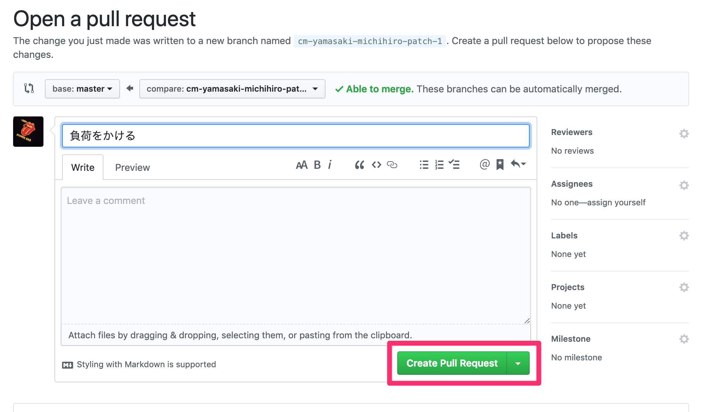
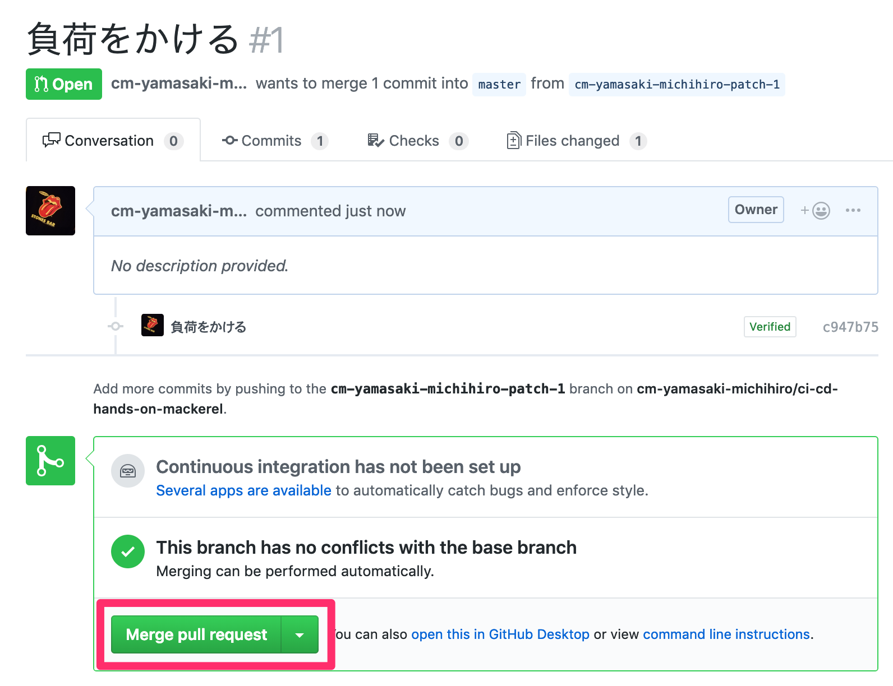
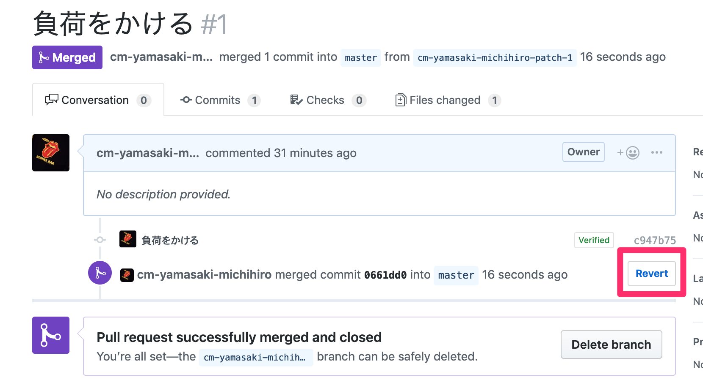

# 負荷がかかる処理を含むコードをデプロイしてみる

アラートが発報された際のロールバックまでの流れを体験するため、デプロイされた状態でアクセスするとCPUの使用率が極端に高まるようなコードをデプロイします。

GitHub上から`src/index.js` 内の以下の行のコメントアウトを解除します。これでアクセスするとCPUに負荷がかかるようになります。

```text
    //while(true){} // CPUをたくさん使用する処理
```

修正したら下の方にスクロールし、コミットしてPull Requestを作成します。


画像のように、`Create a new branch for this commit and start a pull request`を選択し、`Propose file change`をクリックします。

そうすると、Pull Requestの作成画面が開きます。



さらに、作成したPull Requestをマージします。



`Create Pull Request`をクリックします。

CodePipelineによるデプロイが完了したら、サンプルアプリケーションにアクセスします。

すると、すぐにはレスポンスが帰ってこず、ALBでタイムアウトしたあとに以下の画面のようなレスポンスが返ってきます。


また、しばらくするとCPUの使用率が100％になり、Mackerelでアラートが発報されます。


では、問題を解決するため、ロールバックを行いましょう。

GitHub上から当該のコードをロールバックします。

先程マージしたPull Requestの画面より、`Revert`ボタンを選択します。



そうすると、先程マージしたPull Requestの内容を取り消すPull Requestが作成されます。


作成されたPull Requestをマージします。


しばらくすると、アプリケーションの表示は正常に戻り、Mackerelで発報されたアラートもクローズされます。
