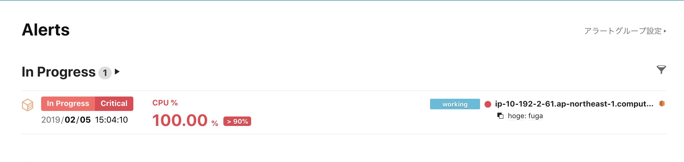

# 負荷がかかる処理を含むコードをデプロイしてみる

アラートが発泡された際のロールバックまでの流れを体験するため、デプロイされた状態でアクセスするとCPUの使用率が極端に高まるようなコードをデプロイします。

`src/index.js` 内の以下の行のコメントを外し、アクセスした際にCPUに負荷がかかるようにします。

修正したらコミットし、GitHubにプッシュします。

CodePipelineによるデプロイが完了したら、サンプルアプリケーションにアクセスします。

すると、すぐにはレスポンスが帰ってこず、ALBでタイムアウトしたあとに以下の画面のようなレスポンスが返ってきます。

また、しばらくすると、Mackerelでアラートが発報されます。

では、問題を解決するため、ロールバックを行いましょう。

GitHub上から当該のコードをロールバックします。

TODO　ドキュメント

