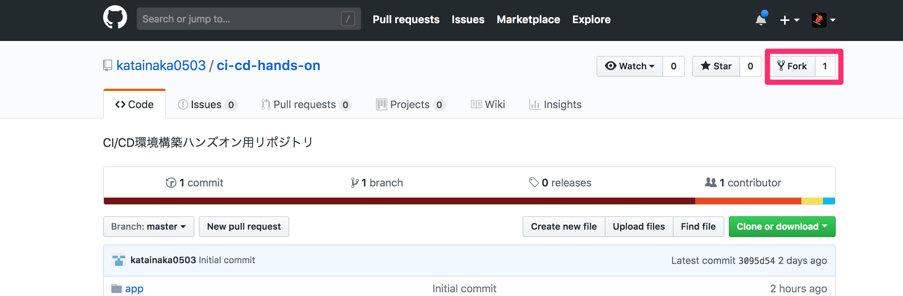

# 準備

## サンプルアプリケーションのフォークおよびクローン

まずは、[このリポジトリ](https://github.com/classmethod/ci-cd-hands-on-codedeploy)をフォークし、自分のアカウントにリポジトリを作成します。

サンプルアプリケーションは、指定された数までFizzBuzzを表示するNode.jsによる簡単なアプリケーションです。



上のリンクからGitHubの当該リポジトリのページに移動し、右上の `Fork` というボタンからフォークを実行します。


自分のGitHubアカウント上に作成されたフォークしたリポジトリから、ローカルのPCにクローンします。作業用のディレクトリで以下のコマンドを実行します。

```shell
$ git clone git@github.com:<ご自分のgithubのアカウント名>/ci-cd-hands-on-codedeploy.git
```

クローンされたリポジトリのディレクトリに移動して中身を確認し、クローンが正しく行われたことを確認します。

```shell
$ cd ci-cd-handson-codedeploy
$ ls
README.md               buildspec.yml           docs                    mkdocs                  package-lock.json       src                     test
appspec.yml             cloudformation          hooks                   node_modules            package.json            template
```

## ハンズオン用環境構築用のCloudFormationの実行

[](https://ap-northeast-1.console.aws.amazon.com/cloudformation/home?region=ap-northeast-1#/stacks/quickcreate?stackName=hands-on-environment&templateURL=https://s3-ap-northeast-1.amazonaws.com/ci-cd-hands-on-template/codedeploy/hands-on-environment.yaml)

上のリンクより、ハンズオン用の環境を構築するためのCloudFormationを実行します。

この、CloudFormationによって、以下の図のような構成の環境が作成されます。


アプリケーションの動作環境以外に後でCodeBuildとCodePipelineで使用するためのIAM Roleを作成しています。

作成したスタックが `CREATE_COMPLETE` の状態になるまで待ちます。

### 動作確認

スタックの出力の中に`AppURL`というキーでURLが出力されています。


こちらのURLにアクセスしてみると、まだソースコードがデプロイされていないため、Nginxのエラー画面が表示されています。