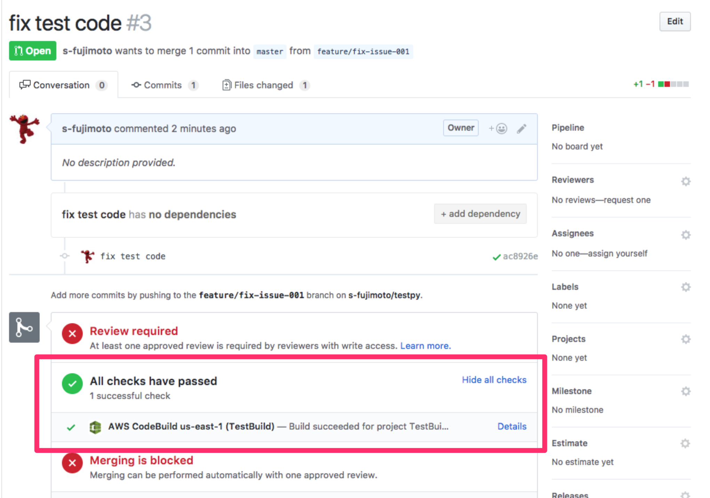

# 参考情報

## 承認を挟んでデプロイする

CodePipelineの編集画面よりステージを追加することで承認のプロセスを挟むことができます。

図では一度ステージングにデプロイしたあと、手動で動作確認し、本番にデプロイするというパイプラインを紹介しています。

## Pull Requestをビルド

CodeBuildを使用することで、Pull Requestのビルドを行うことができます。

- [弊社記事](https://dev.classmethod.jp/cloud/aws/codebuild-github-pullrequest-settings/)

## Blue/Greenデプロイ

今回のハンズオンではインプレースデプロイ、という稼働しているサーバ上にデプロイする方式で構築しましたが。Blue/Greenデプロイ方式でもデプロイを行うことができます。

- [弊社記事](https://dev.classmethod.jp/cloud/aws/codedeploy-blue-green-deployment/)

## ECSへのデプロイ

CodeシリーズではECSへのデプロイも行えます。CodeBuildでイメージをビルドし、新たなイメージをECS上にデプロイするという流れを簡単に構築できます。

- [弊社記事](https://dev.classmethod.jp/cloud/aws/codepipeline-support-ecs-deploy/)

## CodePipelineでの自動デプロイ時に通知

- [弊社記事](https://dev.classmethod.jp/cloud/aws/notify-codepipeline-events-to-slack/)